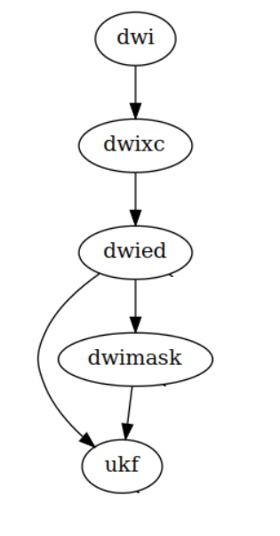

# PNL diffusion pipeline

PNL diffusion pipeline can be elegantly interfaced with MMVT. The diffusion pipeline 
requires either of:

1. a dicom directory
2. a dwi.nrrd

With #1, we cannot provide a mask, because dicom to NRRD conversion has to be done first, 
and then FSL `bet` creates the mask.

However, with option #2, you can additionally specify a good mask.

# Specifying input

## 1. caselist
*pnlpipe* processes one case at a time fetching the caseid from a caselist. So, you 
need to have a `pnlpipe/caselist.txt` where each line is a caseid:
    
    001
    002
    003
    ...
    ...
    
## 2. config file
After fetching a caseid from the caselist, *pnlpipe* attempts to find your input files. 
This is done by substituting caseid placeholder in the [config](pnlpipe_config.py) file:
    

    # an input path is found by looking up its key in INPUT_KEYS
    # value of each key is returned after substituting a caseid"
    # give proper paths for one caseid as your files are stored in your system
    INTRuST = {
        'caseid_placeholder': '001',
        'dwi': '/home/tb571/Documents/pnlpipe_dicom_test/001/001-dwi.nrrd',
        'dwimask': '/home/tb571/Documents/pnlpipe_dicom_test/001/001-dwi_mask.nrrd',
        # 'dicom': '/home/tb571/Documents/pnlpipe_dicom_test/001/dicom/'
    }
    INPUT_KEYS = INTRuST

# Output

Output of the diffusion pipeline is a `.vtk` tract file.

# Running

Every time you edit the config file, do:
    
    ./pnlpipe mmvt init --force # sets up the parameters
    
Then, you should be able to run the diffusion pipeline smoothly:
    
    ./pnlpipe mmvt run

# Dependencies

* BRAINSTools
    * ConvertBetweenFileFormats, unu
    
* FSL
    * bet, flirt, applywarp
    
* dcm2niix
    * dicom to NIFTI/NHDR conversion
    
* python3.6
    * numpy
    * plumbum
    * nibabel
    * nrrd